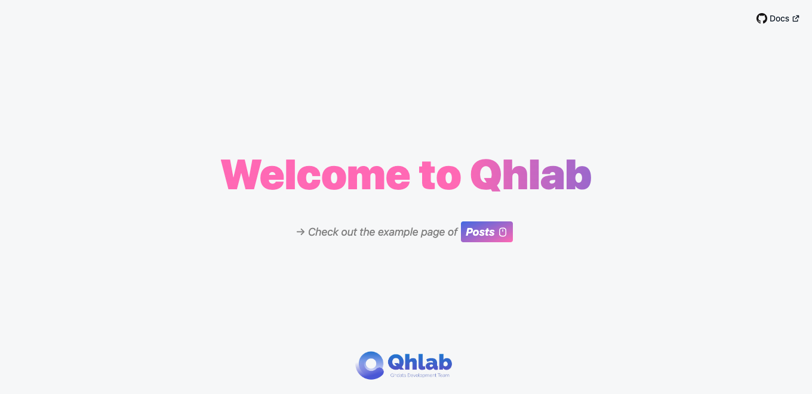

<p align="center">
  
</p>

<br />
<h1 align="center">[Your Project Name]</h1>

<p align="center"></p>
<p align="center">[Describe this project]</p>
<br />

**[⚠️ Built by Qhlab React App V2 architecture, read docs before you get started!!!](docs/latest/README.md)**

<!-- You can remove multi-language if no need -->
English | [简体中文](README.zh-CN.md)

---

- [Installation](#installation)
- [NPM Scripts](#npm-scripts)
- [Knowledge](#knowledge)
  - [Environment Viarables](#environment-viarables)
  - [API URL](#api-url)
  - [Links](#links)
- [Drafts](#drafts)

## Installation

```sh
yarn

#or
yarn install
```

## NPM Scripts

```sh
yarn scripts

#or
yarn scripts run dev
```

## Knowledge

### Environment Viarables

- `REACT_APP_API_URL` - Http request base url
- `REACT_APP_ENABLE_MSW` - Whether to enable mock server
- `REACT_APP_STORAGE_PREFIX` - Storage name prefix
- `REACT_APP_TITLE` - Helmet html base title

### API URL

- Development - http://your-dev-api-url
- Production - http://your-prod-api-url
- Test - http://your-test-api-url

### Links

- Repo - https://your-git-repo-link
- UI - https://your-ui-link
- Prototype - https://your-proto-link
- PRD - https://your-prd-link

## Drafts

[Feel free to write temporary or meaningless information]
