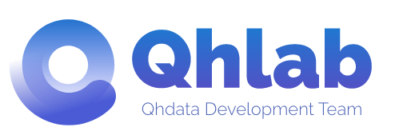

<p align="center">
  
</p>

<br />
<h1 align="center">[你的项目名]</h1>

<p align="center">[简单描述该业务项目]</p>
<br />

<p align="center">
  <strong>
  <a href="https://github.com/QhlabTeam/cra-template-qhlab/tree/main/docs/latest/README.md">
  该项目使用Qhlab React App V2架构构建，开始前请务必阅读文档！！！
  </a>
  </strong>
</p>

<!-- 你可以删除多语言如果不需要的话 -->
<p align="center">
  <a href="README.md">English</a> | 简体中文
</p>

- [安装依赖](#安装依赖)
- [NPM 脚本](#npm-脚本)
- [相关知识](#相关知识)
  - [环境变量](#环境变量)
  - [接口地址](#接口地址)
  - [链接](#链接)
- [草稿](#草稿)

## 安装依赖

```sh
yarn

#or
yarn install
```

## NPM 脚本

```sh
yarn scripts

#or
yarn scripts run dev
```

## 相关知识

### 环境变量

- `REACT_APP_API_URL` - Http 请求的 base url
- `REACT_APP_ENABLE_MSW` - 是否开启 mock server
- `REACT_APP_STORAGE_PREFIX` - Storage 名称前缀
- `REACT_APP_TITLE` - Helmet html 默认标题

### 接口地址

- 开发环境 - http://your-dev-api-url
- 生产环境 - http://your-prod-api-url
- 测试环境 - http://your-test-api-url

### 链接

- 仓库 - https://your-git-repo-link
- UI - https://your-ui-link
- 原型 - https://your-proto-link
- 需求文档 - https://your-prd-link

## 草稿

[随意编写记录临时性或无意义的信息]
